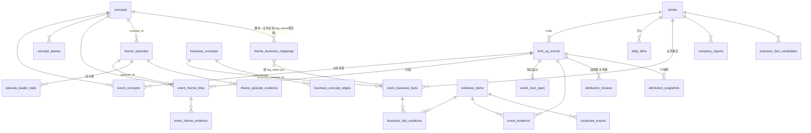

# zt-kg 项目说明书

> **本文档是项目的唯一完整说明书**：架构、背景、表结构、ER 关系、全部指标口径。
> **维护约定（用户定，2026-08-06）**：每次功能迭代前先读本文档；迭代涉及修改
> 关键信息（表结构、口径、数据流、文件职责）时，必须在同一次迭代中同步更新本文档。
> CLAUDE.md 保留"操作约定+近期变更日志"角色，本文档负责"系统是什么、怎么算"。

---

## 1. 项目背景与定位

A 股每日涨停股 + 涨停原因（概念题材）的长周期追踪库，服务于用户的**龙头跟涨**
短线策略。核心回答四个问题：

1. 今天涨停的股票，按什么题材在炒？（归因）
2. 这个题材这一轮从何时启动、现在什么阶段、谁是龙头/龙二/龙三？（轮次+龙头）
3. 题材圈中哪些股票——已异动的和有业务但还没异动的？（六层名单/watch 池）
4. 市场情绪如何——涨停家数、封板率、隔日开盘溢价趋势？（情绪面）

**所有输出为行情数据整理，不是投资建议。**

### 1.1 系统宪法（不可违背）

- **零人工干预**（2026-07-25 用户定）：所有队列由自动工序收敛，不存在"等人工"
  状态。人工唯一入口 = 用户发现 bad case 主动反馈 → 覆盖文件（facts_overrides
  等）+ 必要时调紧自动规则。任何新功能不得设计"需人工确认才能推进"的环节；
  自动判决必须留痕（decided_by/source）、保守（拿不准 leave 不硬判）、可被覆盖。
- **LLM 调用走本机 claude CLI 无头模式**（`claude -p --model claude-sonnet-5`，
  订阅计费，不用 API）；模型名统一 `claude-sonnet-5`（归因判决/分型/年报抽取），
  一句话归因用 haiku。
- **范围 = 一年内涨停过的股票**（2026-08-04 用户定界），不扩全市场。
- **昨日涨停信息必须次日 9 点前补齐**（2026-08-05 用户定）→ 早班班次的存在理由。
- db / logs / report_cache 永不入 git；公网只暴露 docs/ 静态内容。
- 派生数据（event_concepts、语义层链接、轮次、龙头榜）可随时全量重建，幂等。
- 原始数据永不删改：`limit_up_events.reason_type` 永存供应商原始字符串。

---

## 2. 系统架构总览

```
同花顺涨停池API ─┐                         ┌→ docs/data.js ──┐
东财搜索(新闻)   ├→ SQLite (data/ztkg.db) ─┤                 ├→ docs/index.html 单页应用
东财K线(push2his)│   原始层→概念层→语义层   └→ docs/data-kline.js  (GitHub Pages 公网)
巨潮(公告/年报)  │   →派生指标层
互动易/上证e互动 ┘        ↑
claude CLI (sonnet/haiku) ┘ 归因判决/分型/年报抽取/一句话解读
```

三层数据流水线（全部幂等，可重跑）：

1. **原始层**：抓取入库（fetch_daily / backfill / fetch_news / fetch_next_open /
   fetch_event_announcements / fetch_company_reports / fetch_interactive_qa）。
2. **语义层**：`rebuild_semantic_layer.py` 每次运行 DELETE+全量重算派生表——
   题材归因链接、题材轮次、龙头榜、业务事实晋升、覆盖重放（facts_overrides）。
3. **导出层**：`audit_tags.py` 门禁通过后 `build_site.py` 生成 data.js /
   data-kline.js；`.deploy-enabled` 存在时 deploy.sh 推 GitHub Pages。

### 2.1 双班次（launchd，工作日）

| 班次 | 时间 | 脚本 | 干什么 | 不干什么 |
|---|---|---|---|---|
| 早班 | 07:40 | run-morning.sh | 隔夜新闻/公告/互动回复/年报候选收拢（--days 4 覆盖周一）→ rebuild 晋升候选 → T+复核 → judge 判决 → rebuild → audit → build_site → 发布。目的：9 点前昨日涨停股信息完整 | 不抓当日涨停池（盘前无数据）、不跑 fetch_next_open（无当日开盘价）、不跑分型/映射/挂树慢工序 |
| 晚班 | 17:00 | run-daily.sh | fetch_daily（当日双池）→ fetch_next_open（昨日事件的今日开盘价+日K）→ 新闻/公告/summarize → 分型链（gen_tag_meta/classify/auto_adopt）→ gen_theme_mappings → rebuild → T+复核 → judge → rebuild → audit → build_site → 发布 → **发布线以下慢工序**：年报抓取/抽取、互动抓取、gen_business_tree 挂树 | 慢工序产生的候选等次日早班 rebuild 晋升（既定顺序，不是 bug） |

安装/状态：`bash install-launchd.sh status|install|test-morning`。
launchd 用 homebrew bash（TCC 权限），日志在 `logs/daily-*.log` / `logs/morning-*.log`。

### 2.2 部署

- 线上：https://sammyandshen.github.io/zt-kg/ （仓库 SammyandShen/zt-kg 公开，
  main 分支 /docs 目录，含 .nojekyll）
- `deploy.sh` = git add -A → 有变更才 commit+push。**坑：手动 commit 后工作树
  干净，deploy.sh 会"无变更跳过"且不 push——需手动 `git push origin main`**。
- `.deploy-enabled`（.gitignore 内）存在时班次自动发布，删掉即停。
- 本地预览：`~/Documents/CC/.claude/launch.json` 的 ztkg-site 配置
  （http.server 8123）。**勿在 zt-kg/ 下建 .claude/**——会被 deploy 的
  git add -A 扫进公网仓库。

---

## 3. 目录与文件职责

```
zt-kg/
├── ARCHITECTURE.md      本说明书（迭代前必读，改口径必同步更新）
├── CLAUDE.md            操作约定 + 变更日志（AGENTS.md 是其软链接）
├── run-daily.sh         晚班入口    run-morning.sh  早班入口
├── deploy.sh            发布        install-launchd.sh  定时任务装卸
├── launchd/             两个 plist（com.user.zt-kg / com.user.zt-kg-morning）
├── data/                ztkg.db 主库 + 词典/台账 JSON（见 §6）+ report_cache/（不入git）
├── docs/                公网静态站：index.html（人工维护）+ data.js/data-kline.js（生成，禁手改）
├── scripts/             全部 Python 工序（见下表）
├── logs/                班次日志（不入git）
└── backtests/           回测输出存档
```

### 3.1 脚本一览（scripts/）

| 脚本 | 职责 | 写哪些表 |
|---|---|---|
| common.py | 共享层：同花顺抓取、DDL、归一化管线、幂等入库 | （被调用方写） |
| fetch_daily.py | 当日双池（zt+touch）入库 | limit_up_events, stocks, event_concepts, day_stats, fetch_log |
| backfill.py | 历史回补（断点续传，只补缺） | 同上 |
| fetch_next_open.py | 东财前复权K线 → 隔日开盘溢价 + 日K落库 | event_next_open, daily_kline |
| fetch_news.py | 东财搜索涨停关联新闻 | news, news_log |
| summarize_news.py | claude CLI(haiku) 一句话涨停归因 | briefs |
| fetch_event_announcements.py | 巨潮公告（涨停日±2天催化词命中） | evidence_items, event_evidence, corporate_events |
| fetch_company_reports.py | 巨潮最新完整年报 PDF→文本缓存 | company_reports |
| extract_business_candidates.py | 年报 → 主营候选（claude CLI，失败退回规则抽取） | business_fact_candidates, evidence_items |
| fetch_interactive_qa.py | 互动易(深)/上证e互动(沪) 供应链候选 conf=0.55 | business_fact_candidates |
| gen_tag_meta.py | 新标签登记草稿（candidate） | data/tag_meta.json |
| classify_tags.py | claude CLI 分型复核（台账 llm_review.json 续传） | tag_meta.json, llm_parent_suggestions.json |
| auto_adopt_tags.py | 高置信分型转正 + 父建议四道闸挂树 | tag_meta.json, taxonomy.json |
| gen_theme_mappings.py | 题材→业务标签/图谱节点映射（candidate，台账防重） | data/theme_business_mappings.json |
| gen_business_tree.py | 孤立 product 归产业父节点；--refine 大产业聚细分 | data/business_tree.json |
| rebuild_tags.py | aliases/expansions 改后重建 event_concepts（--dry-run 预演） | event_concepts, concepts, concept_aliases |
| rebuild_semantic_layer.py | **语义层核心**：归因/轮次/龙头/晋升/映射导入/覆盖重放 | event_theme_links, theme_episodes, episode_leader_daily, stock_business_facts, business_concepts(+edges), attribution_snapshots |
| review_theme_attributions.py | T+0/1/2 归因旁证评分 | attribution_reviews |
| judge_attributions.py | claude CLI 三队列判决（保守；写覆盖台账） | data/facts_overrides.json |
| audit_tags.py | 质量门禁（只读；不过则停发布） | — |
| build_site.py | 导出 data.js / data-kline.js | docs/data.js, docs/data-kline.js |
| backtest_leader.py | 龙头评分回测（只读，不进班次；--scan 权重敏感性） | — |
| query.py | CLI 查询（codes/stock/concept/date/similar/tree/review-*） | — |

---

## 4. 数据库表结构（data/ztkg.db，SQLite WAL）

DDL 唯一定义处 = `scripts/common.py` 的 `DDL` 常量 + `open_db()` 内迁移。
连接必开 `PRAGMA foreign_keys=ON; busy_timeout=30000`（工序并发等锁）。

### 4.1 原始行情层

| 表 | 主键/唯一 | 说明 |
|---|---|---|
| **limit_up_events** | UNIQUE(trade_date, code, source) | 涨停事件主表。`pool`：zt=收盘封住 / touch=触及未封(炸板)。炸板记录无 reason/连板数，不建概念关系不进热度归因。关键列：reason_type(原始原因，永不删改)、high_days_value(编码 `板数<<16\|天数`)、lb_count(解码板数)、limit_up_type(一字/T字/换手)、first_time/last_time(epoch秒)、open_num(炸板次数,NULL=0)、order_amount(封单额)、currency_value(流通市值)、turnover_rate |
| **stocks** | code | 股票名册（first/last_seen_date 随入库更新） |
| **day_stats** | trade_date | 市场级：num 封住家数 / history_num 触板家数 / rate 封板率 / open_num 炸板家数（同花顺给出） |
| **fetch_log** | (trade_date, source) | 抓取记账；炸板池 source='ths:touch' |
| **event_next_open** | event_id | 隔日开盘溢价：next_date, event_close, next_open, open_pct（口径见 §7.3）。只记 zt 池 |
| **daily_kline** | (code, trade_date) | 东财**前复权**日K（o/c/h/l/v）。前复权值随除权漂移→每次抓取整段 upsert 覆盖。刷新集合=有欠账事件的股票 ∪ 非closed轮次成员 |

### 4.2 概念标签层（交易题材命名空间）

| 表 | 主键 | 说明 |
|---|---|---|
| **concepts** | id, name UNIQUE | 规范概念名（题材/催化/属性都在此） |
| **concept_aliases** | alias | 别名→concept_id（源=aliases.json） |
| **event_concepts** | (event_id, concept_id) | 事件↔概念，**纯派生**，raw_tag 记归一化前原始写法；rebuild_tags.py 全量重建。查询时只能称"历史原因标签"，不是归因 |

归一化总管线（common.normalize_tags，入库与重建共用）：
拆分(+号) → 一对多展开(tag_expansions) → 别名归一(aliases) → 丢弃已退休 event 标签。

### 4.3 语义证据层

| 表 | 主键/唯一 | 说明 |
|---|---|---|
| **evidence_items** | evidence_key UNIQUE | 证据登记：类型 ths_reason/news/announcement/report/regulator/llm_summary，subject_status 区分 direct/market/third_party |
| **business_concepts** | UNIQUE(name, concept_type) | 公司业务图谱节点，type=sector/product。**与 concepts 独立命名空间，禁止共用 id 或按名隐式连接**（同名"脑机接口"是两个实体） |
| **business_concept_edges** | (parent_id, child_id) | 业务图谱层级边；source=manual/auto_tree/auto_report。三层结构：根产业→细分(一级，refine 生成)→产品 |
| **stock_business_facts** | UNIQUE(code, tag_name, relation_type, valid_from) | 公司客观业务事实。relation：core/secondary/research/holding/supply_chain/planned_acquisition；maturity：core_revenue/commercialized/early_revenue/research/holding/proposed；status：candidate/verified/rejected/expired；revenue_share 年报披露分部占比(0-100,可NULL) |
| **business_fact_evidence** | (fact_id, evidence_id) | 事实↔证据 |
| **theme_episodes** | UNIQUE(concept_id, start_date) | 题材轮次。phase：candidate/startup/fermentation/climax/divergence/recession；status：provisional/verified/closed/rejected |
| **event_theme_links** | (event_id, concept_id) | **单次涨停按什么题材交易**（≠历史标签）。theme_role primary/secondary/candidate；status candidate/verified/rejected/expired；basis_kind 凭据：business_fact/announcement/NULL(仅盘面联想)；market_role='leader' 为龙头 rank1 兼容写回 |
| **event_evidence** | (event_id, evidence_id) | 事件级上下文证据（公告等） |
| **event_theme_evidence** | (event_id, concept_id, evidence_id) | 题材级旁证（新闻同时点名股票+题材才绑定） |
| **theme_episode_evidence** | (episode_id, evidence_id) | 轮次级证据 |
| **theme_business_mappings** | (concept_id, business_tag_name) | 题材→业务标签映射（源=JSON+图谱展开行 source='graph' 每日重生成）。可研究公司池，≠本轮成分 |
| **company_reports** | (code, report_year) | 年报抓取台账（PDF/文本在 report_cache/，不入git） |
| **business_fact_candidates** | UNIQUE(code, report_year, tag_name, relation_type) | 年报/互动抽取的主营候选，等 rebuild 晋升 |
| **attribution_reviews** | (event_id, concept_id, stage) | T+0/1/2 旁证评分。**故意无外键**（2026-08-03 事故：CASCADE 曾把复核连带删光）；孤儿由 rebuild 尾部显式清理 |
| **attribution_snapshots** | (event_id, concept_id) | T0 归因快照，重建永不覆盖——回测"按当晚归因跟随"的点值基础 |
| **corporate_events** | UNIQUE(code, event_date, evidence_id) | 公告派生公司事件（8类）；clarification 类型驱动候选澄清击杀 |

### 4.4 派生指标层

| 表 | 主键 | 说明 |
|---|---|---|
| **episode_leader_daily** | (episode_id, trade_date, rank) | 轮次龙头榜逐日快照，rank 1/2/3。score=EMA、raw_score、parts=六分项JSON、state=active/resting、source=derived/override。**纯派生**：derive_leader_board 唯一写入方，每次 rebuild DELETE 全量重算，幂等已验证 |

### 4.5 辅助表

news / news_log / briefs（新闻与一句话解读，成熟度规则见 §7.9）、meta(k/v)。

---

## 5. ER 关系图



要点：
- **两个命名空间**：concepts（市场在炒什么）vs business_concepts（公司在做什么），
  桥梁只有 theme_business_mappings（按 business_tag_name 弱连接到事实表）。
- **四段语义闭环**：business_facts(公司做什么) → event_theme_links(这次按什么炒)
  → theme_episodes(这轮何时起/什么阶段) → theme_business_mappings(反查公司池)。
- attribution_reviews / attribution_snapshots 用自然键、无外键——rebuild 删重建
  derived 链接时它们必须存活。

---

## 6. 配置与词典文件（data/*.json）

| 文件 | 谁写 | 说明 |
|---|---|---|
| aliases.json | 人工/LLM(确认后) | 概念别名 {规范名:[别名]}；只做严格同义词；改后 `rebuild_tags.py` |
| tag_expansions.json | 人工/LLM(确认后) | 一对多拆解（复合事件标签→题材+催化）；不得与 aliases 重叠、不得链式；改后先 --dry-run |
| taxonomy.json | 人工/LLM(确认后) | 题材标签层级 {父:[子]}，多父允许；只允许 active 节点、父子同频道；违规 build_site 直接失败 |
| tag_meta.json | gen_tag_meta 草稿+自动分型链 | 标签七类分型注册表（§7.8） |
| semantic_config.json | 人工校准 | 语义层全部阈值 + leader 段 + **calibration_log**（每次校准必追加旧值和理由） |
| facts_overrides.json | judge/治理台导出 | 人工/LLM 判决台账（归因/轮次/龙头席位），rebuild 每次重放 |
| business_facts.json | 人工核实 | 公司业务事实人工条目（bad case 覆盖通道） |
| event_attributions.json | 人工核实 | 某股某日归因人工条目 |
| theme_business_mappings.json | gen_theme_mappings | 题材→业务映射台账（candidate 起步） |
| business_tree.json | gen_business_tree | 挂树台账：条目=product→父产业；groups 段=细分→产业；refined 段防重问 |
| llm_review.json / llm_parent_suggestions.json | classify_tags | 分型判决台账/父建议（不自动改树） |
| similar_dismissed.json | Claude 判决留痕 | 疑似重复"已判不并"名单（精确对+整族正则） |

覆盖优先级：人工 JSON（manual）> 自动生成（auto_*）；rebuild 重放时 manual 不被覆盖。

---

## 7. 指标计算口径大全

> 前端展示口径的唯一运行时来源是 `docs/index.html` 内 **METRIC_DEFS 注册表**
> （页面一律 ⓘ 悬停展示，禁止写死定义卡）。本节是其后端算法版，两处必须一致。

### 7.1 基础字段口径

- **连板数 lb_count** = `high_days_value >> 16`（如 196612 = 4天3板 → 3）。
- **封成比 fss** = order_amount / currency_value（封单额/流通市值），全库中位数
  0.84%（config `leader.quality_fss_median_pct`）。
- **封板率**（市场级）= num / history_num（同花顺 day_stats 直取）。
- **首封时间** first_time 为 epoch 秒，展示转 HH:MM；日内分钟数
  `hhmm_minutes = 分钟-570`（9:30起算），>120 再减 90 折叠午休。
- **板型**：一字板 / T字板 / 换手板（limit_up_type 原文）。

### 7.2 板块热度与生命周期

- **板块热度** = 标签层级子树内每日**去重**涨停家数（业务图谱侧走
  businessDescendants 传递闭包）。
- **启动判定** = 近3日均≥3家 且 ≥2.2×前15日基线。
- **变化面**（只看题材层）：动量 = 近3日均/前15日均——🔥加速中≥1.6、
  🌱新启动=近3日有量且前15日≈0、🌊退潮中≤0.55。
- **生命周期徽章**（休眠/活跃/启动/高潮/退潮）由热度曲线自动判（METRIC_DEFS）。

### 7.3 隔日开盘溢价（event_next_open）

- `open_pct = (next_open / event_close − 1) × 100`，价格取东财 push2his
  **前复权 fqt=1** K线——相邻两根K线比值不受除权除息影响。
- 停牌顺延到复牌首根K线（对持仓者就是"下一个开盘"）。只记 zt 池事件。
- 待补集合排除最新交易日事件（次日未开盘，天然待明日）；市场前缀猜 1/0，
  错了自动换边重试（北交所=0）。
- 日级聚合（data.js `next_open`）：[全体均值, 高开比例%, 低开比例%, 高开股均涨幅,
  低开股均跌幅, 样本数]——**比例不含平开**。全年基线：均值 +2.11%，高开率 64.6%。
- 个股级聚合（`stock_stats`）：[本股均值, 高开率, 样本数, rank1轮次数, rank2/3轮次数]。

### 7.4 题材轮次（theme_episodes，semantic_config.episode）

- **立轮双门槛**：整轮去重股票 ≥ min_codes=3 且触发日同日 ≥ min_same_day=3 家、
  首封时间极差 ≤ first_seal_span_min=90 分钟（缺首封时间的不参与判定）。
  不达标不造题材（单股公告驱动归个股事件）。
- **断轮时钟只认活跃日**：当日该题材 ≥ sustain_min_members=2 只才算活跃日；
  连续 gap_days=5 个交易日无活跃日即断轮。
- **动量衰减断浪**：续命日广度须 ≥ ceil(本浪峰值 × wave_decay_ratio=0.25)，
  涓流尾巴不续命；断浪后峰值清零，新浪重过立轮双门槛。
- 轮末距最新交易日 ≤5 交易日保持开放(divergence)，超窗关轮(recession/closed)。
- 同期开放轮成员重叠 ≥ overlap_warn=0.5 打印并轮告警（只告警不自动合并）。
- 起点落在数据窗口最早6个交易日内 → 导出截断标记（episode 数组 idx9），
  页面提示"起点早于数据窗口"（同花顺源仅1年滚动窗口）。

### 7.5 涨停归因（event_theme_links）

- **link_basis 强制凭据**：派生归因必须引用业务边(basis_kind='business_fact')或
  官方公告('announcement')；无凭据=仅盘面联想，**置信度封顶 0.45**，页面标"无凭据"。
- verified 归因强制证据：应用 verified 判决时必须绑定 ≥1 条新闻/公告旁证
  （supporting 优先，至多3条），绑不上保持 candidate；audit 门禁查全部 verified。
- **候选退场**：产生后 candidate_expire_days=10 个交易日未进任何轮次且无
  supporting 旁证 → expired；澄清公告点名题材 → 对应候选直接 rejected。
- **T+复核**（attribution_reviews，只作旁证排序，任何分数不自动升 verified）：
  T+0 看同日题材广度+题材级证据+业务映射；T+1 看次日广度+同股延续；T+2 再看延续。
- **judge 三队列**（claude-sonnet-5 保守判决，写 facts_overrides 留痕）：
  ①活跃轮次主炒归因(近2日) ②新轮次提案(近3日，喂系统自动推导的 auto_catalyst，
  模型只核对一致性) ③龙头认定已改为评分体系自动产出。verified 需可解释关联+
  当日叙事主导；rejected 需明确反证；拿不准一律 leave 等过期。

### 7.6 龙头/龙二/龙三评分体系（episode_leader_daily，config.leader）

rebuild 内 `derive_leader_board` 逐轮逐活跃日计算，无未来函数。

**资格**：截至当日在本轮有 ≥1 条 zt 成员事件，且轮内截至当日最高连板 ≥ min_lb=2
（首板不认）。首个合格日之前榜单空缺。

**在场状态机**：active（当日有本轮 zt 事件）/ resting（无 zt 事件但距上一涨停
≤ rest_days=2 个活跃日，或当日在 touch 池）/ exited（超时→移出榜单、EMA 清除；
再涨停以 ema=raw 重进）。

**六分项 raw ∈ [0,1]**（权重 = config.leader.weights）：

| 分项 | 权重 | 公式 |
|---|---|---|
| space 空间 | .30 | 0.5·min((lb−1)/6, 1) + 0.5·(lb/当日轮内最高板)；resting=0 |
| first 先手 | .15 | 0.5·T_seal + 0.5·T_entry。T_seal=1−clamp(首封日内分钟/150)；T_entry=1−clamp((轮内进场身位−1)/3)，身位=首涨日的活跃日位次 |
| quality 封板质量 | .20 | 0.5·Q_seal + 0.3·Q_stable + 0.2·Q_type。Q_seal=clamp(ln(1+封成比/中位0.84%)/ln9)；Q_stable=1/(1+炸板次数)；Q_type 一字1.0/T字0.85/换手0.7。resting/touch 日=0 |
| purity 正宗度 | .10 | clamp(max归因置信 [verified≥0.85] + 0.10·业务凭据 + 0.05·营收占比≥30) |
| premium 隔日溢价 | .15 | clamp(0.5 + (该股本轮已实现开盘溢价均值 − 轮均)/10)；无样本=0.5 |
| resilience 断板韧性 | .10 | 无断板史=0.6；断板日跌幅≥−5% 且 ≤2活跃日反包→1.0，反包慢→0.5，断板日≤−8%→0.1（线性内插，用 daily_kline）；resting 日按断板日实时跌幅 −2%→0.7 … −9.5%→0 内插 |

**EMA 平滑**：ema = α·raw + (1−α)·ema_prev，α=0.5，按活跃日序递推，首进 ema=raw。
resting 日动态分项归零 → EMA 自然衰减（"断板不反包两日让位"无需额外规则）。

**换龙规则**：
- rank1 滞后：挑战者 ema 须 > 现任 ema × (1 + swap_margin=**0.25**) 才换龙；
  现任 exited 则当日 ema 最高者接任；旧龙回封走同一 margin 可复辟。
- rank2/3：当日 ema 降序直排，无滞后，不足空缺。
- 并列裁决（保证幂等）：ema → T_entry → T_seal → code 升序。
- **closed 轮盖棺**：整轮龙头 = rank1 在位活跃日最多者（平手→在位期 ema 峰值→
  更早上位）；龙二/龙三 = 其余按榜面 score 累计前二。
- 覆盖：facts_overrides.leaders 钉**当前榜**席位（patch 带 rank，缺省1；值格式
  {rank:code}，历史时间线不改），被覆盖行 source='override'。
- market_role='leader' 保留为 rank1 兼容写回（rank2/3 不写，词表不扩）。

**回测结论**（backtest_leader.py，2026-08-05 校准）：rank1 隔日开盘超额
+1.22pct（胜率61%，t≈8.8，n=735）> 旧最高板基线 +1.06pct；单调
rank1>rank2>rank3；权重 ±0.10 敏感性均在噪声内（平坦最优）；swap_margin
0.25 使 >4次换龙轮占比 26%→23% 且超额微升，0.35 起伤超额。

### 7.7 个股页交易概览（8块）

| 块 | 口径 |
|---|---|
| 最新收盘 | data-kline.js 末根收盘 ± 近20日涨跌% |
| 流通市值 | 最近一次涨停事件的 currency_value |
| 涨停战绩 | 库内 zt 次数 / (zt+touch)，封住率 |
| 连板能力 | 最高连板 + 连板分布 |
| 本股隔日溢价 | stock_stats：开盘溢价均值/高开率/样本数，对照全市场基线 +2.11%/64.6% |
| 首封习惯 | 平均首封分钟 → 竞价(≤1min)/早盘/午前/午后型 |
| 封单力度 | 平均封单额 + 平均封成比 |
| 龙头履历 | 担任 rank1 的轮次数 / rank2-3 的轮次数（轮次去重） |

**"停后"指标**（概念页六层名单 mini 卡）= 最新收盘 vs 该股涨停日收盘的涨跌%，
衡量"涨停之后到现在拿住的话赚/亏多少"。

### 7.8 标签七类分型（tag_meta.json）

- 类型：sector(稳定大产业) / product(细分行业、产品、技术、业务线) /
  theme(交易题材) / catalyst(催化) / attribute(属性) / event(一次性事件，
  仅过渡分型，终态一律 retired 出词典走 corporate_events) / unknown。
- **频道由类型直接决定**：sector|product|theme→题材热力+启动榜；catalyst→催化
  热力；其余不进热度。virtual=true 仅聚合导航。
- status：active(正式) / candidate(不进正式热度) / retired。正式热力二次校验：
  节点及后代必须 active 且与根同频道。
- 边界：产业回答"长期做什么"，题材回答"市场当前交易什么"；`XX供应商/客户`
  是 attribute，`XX产业链/XX概念`是 theme。
- 分型链（零人工）：gen_tag_meta 登记 → classify_tags(sonnet 复核，active 改判
  门槛 conf≥0.8) → auto_adopt_tags 转正+挂树四道闸。

### 7.9 新闻与解读成熟度

- 抓取窗口 [涨停日−2, +1]，标题点名优先、榜单类降权，每次最多存3条（URL去重）。
  每股查两次（时间序+相关性序合并），防大盘综述刷屏。
- **成熟度规则**（news_log/briefs 共用）：上次抓取/生成早于「涨停日+2天」=窗口
  未关闭=不成熟，--days 覆盖到就自动重查/重算；之后为终态永久跳过。
- data.js 只导出最近 60 个交易日的新闻/briefs（控体积）。

### 7.10 六层名单（概念页轮次卡）

按关系成色分层：①核心业务(core/secondary 已商业化) ②直接成长(early_revenue/
research) ③上下游映射(supply_chain，互动平台候选专用层) ④参股布局(holding)
⑤拟收购转型(planned_acquisition/proposed) ⑥纯市场联想(无业务证据)。
实心=本轮已涨停(trading)、虚线=有业务未异动(watch，按"映射已核实>营收占比"排序)。
层级由 relation/maturity 机械映射。产业热力只统计 core|secondary 且已商业化的
verified 事实；③④⑤只进反查候选池。

---

## 8. 导出层 schema

### 8.1 docs/data.js（`const ZTKG_DATA = {...}`）

| 键 | 结构 |
|---|---|
| dates | 交易日数组（升序，全站日期轴） |
| day_stats | {date: [num, history_num, rate, open_num]} |
| next_open | {date: [avg, up%, down%, avgUp, avgDown, n]} |
| concepts | {cid: [name, 总次数, 活跃天数]}；aliases {别名: cid} |
| stocks | {code: name} |
| events | {date: [[code, 连板数, high_days, 板型, 炸板次数, 封单万, 流通市值亿, 首封HH:MM, 原始原因, [概念id], touch?]]}（idx10=1 表示炸板池） |
| taxonomy / tag_meta / llm_sugg / similar_dismissed | 词典三件套+LLM建议 |
| news / briefs | 键 "code\|date"，近60交易日 |
| business_facts | {code: [[tag, fact_type, relation, maturity, status, conf, summary, valid_from, valid_to, [evidence_ids], business_concept_id, revenue_share]]}（idx11=营收占比） |
| business_graph | {concepts: {id:[name,type,status]}, taxonomy: {parent:[children]}} |
| business_fact_candidates | {code: [[id, year, tag, type, relation, maturity, conf, summary, evidence_id, extractor]]} |
| event_themes | {"code\|date": [[cid, role, relation, market_role, status, conf, rationale, episode_id, source, [evidence_ids], review, basis]]}（review=[stage,verdict,score,mature,...]，basis=["fact",标签]/["ann",id]/null） |
| event_context_evidence | {"code\|date": [evidence_ids]} |
| theme_episodes | {epId: [cid, start, end, phase, status, catalyst, conf, 股票数, [evidence_ids], 窗口截断标记]}（idx9） |
| episode_leaders | {epId: [board, timeline]}。board=[[code, rank, score, state, [六分项], override01]]（开放轮=最新活跃日榜；closed=盖棺榜）；timeline=[[date, code]] rank1 变更点压缩（含首任） |
| kline_thumbs | {code: [[o,c,h,l]×≤30]}——范围：开放轮或近10日内收轮的榜面股 ∪ 最新日 zt 池 |
| stock_stats | {code: [溢价均值, 高开率, n, rank1轮次数, rank2/3轮次数]} |
| theme_business_candidates | {cid: [[code, 业务标签, relation, maturity, 事实status, 事实conf, summary, 映射type, 映射status, 映射conf, rationale, [evidence_ids], revenue_share]]} |
| semantic_evidence | {eid: [type, source, title, url, published, subject_status, claim, reliability]} |

### 8.2 docs/data-kline.js（~13MB，懒加载）

`window.ZTKG_KLINE = {dates: [近120交易日], bars: {code: [[o,c,h,l,v]|null ×120]}}`
——全部涨停股对齐全局日期轴，停牌位 null。个股/概念页打开时 `ensureKline()`
script 注入加载（file:// 兼容）。build_site 每日随班次重生成。

### 8.3 前端页面地图（docs/index.html 单页应用）

| 路由 | 页面 | 要点 |
|---|---|---|
| #/date/{d} | 每日复盘 | 顶部标签库日报卡（覆盖率/未入树/待审/🆕新面孔） |
| #/heat | 板块热力 | 四段式：市场状态条→今日主线卡（6张，统一骨架：三席K线卡[评分席位或"未成轮·按板数领涨"回落]+成员chips+热度柱钉底）→变化面→结构面+交叉透视+bump+三层热力表 |
| #/trend | 情绪趋势 | 涨停家数/封板率/最高板 + 隔日开盘溢价两卡 |
| #/concept/{cid} | 概念页 | 轮次卡+龙头三席+换龙时间线+六层名单（tier mini 卡=K线+停后%）+上下级 chips |
| #/stock/{code} | 个股页 | 日K全图(MA5/10/20+量柱+涨停▲炸板△+十字悬浮) + 概览8块 + 涨停史 |
| #/tags | 标签中心 | 三页签：题材全景 / 全局筛选(#/filter 兼容) / 治理台（三队列+补丁导出） |
| #/business | 业务图谱 | 产业榜（只列无 sector 祖先的根产业）|
| #/batch #/tagday | 批量归类 / 某日某标签 | |

约定：METRIC_DEFS 是全站指标定义唯一来源（ⓘ悬停）；手写 SVG 不引库；
主题字节蓝绿（--accent #2e6be6 / --teal #00b6a1，红色 --up 只留涨停语义）。

---

## 9. 运维备忘（常见坑）

- 同花顺 API 仅**约1年滚动窗口**，更早报"date参数不合法"（DateOutOfRangeError）；
  多源防双计：build_site 按 SOURCE_PRIORITY（ths>wencai>kpl）每(日,股)只导出一条。
- 前复权K线随除权漂移 → daily_kline 每次整段覆盖 upsert，不做增量假设。
- attribution_reviews 千万不要加回外键（会被 rebuild 级联清空）。
- deploy.sh 在工作树干净时**不 push**；手动 commit 后要自己 push。
- 浏览器验证页面：用 http.server + `index.html?v=N` + `fetch(url,{cache:'reload'})`
  破缓存；热力页路由是 **#/heat**。
- claude CLI 不在 launchd PATH 时脚本自动找 ~/.local/bin 等位置。
- 慢工序候选"当天不晋升"是设计（次日早班晋升），不是 bug。
- 8月底待办：wave_decay_ratio / sustain_min_members / candidate_expire_days /
  龙头权重 随数据增厚复核（见 semantic_config.calibration_log）。

## 10. 文档维护约定

1. **迭代前**：先读本文档相关章节（表→§4/§5，指标→§7，导出→§8，流程→§2）。
2. **迭代中**：改表结构/口径/数据流/文件职责 → 同一次提交内更新本文档对应章节；
   阈值校准另须追加 semantic_config.calibration_log；前端口径同步 METRIC_DEFS。
3. CLAUDE.md 与本文档冲突时，以**代码为准**并立即修正文档；两文档分工——
   CLAUDE.md=操作约定+变更时间线，ARCHITECTURE.md=系统全貌+口径权威。
